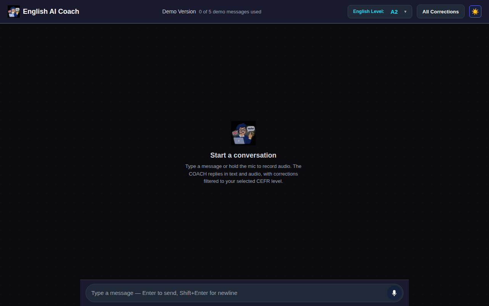

# English AI Coach — Demo Version

> Browser-based English tutor that listens, transcribes, corrects, and
> speaks back. Built as a Next.js + FastAPI showcase of a free-model
> LLM routed through OmniRoute (a self-hosted multi-provider gateway).



## Features

- Conversational chat (English only) with WhatsApp-style audio bubbles
- Hold-to-record audio input (browser MediaRecorder)
- Free-text input with Enter-to-send
- Choose CEFR level (A1 beginner → C2 proficient) from a topbar dropdown
- Live TTS replies (en-US-AriaNeural via edge-tts)
- Live corrections panel with severity (critical/minor) and category
  badges (grammar / vocabulary / style / word_order)
- "All Corrections" modal: see the entire conversation error history
- Demo Version badge to flag the prototype status
- Connected to free LLM models via the OmniRoute gateway — no API key
  required, no usage caps.

## Tech Stack

- **Frontend**: Next.js 14, React 18, TypeScript, CSS Modules
- **Backend**: FastAPI 0.110, uvicorn, Pydantic v2
- **ASR**: faster-whisper (local CPU inference)
- **TTS**: edge-tts (no API key, en-US-AriaNeural)
- **LLM**: routed by OmniRoute → free model via OpenAI-compatible API
- **Tests**: pytest (backend), Jest (frontend), Playwright (e2e)

## Quickstart

### Prerequisites

- Python 3.11+
- Node 20+
- A running OmniRoute instance (or any OpenAI-compatible endpoint)
  configured via the `OMNIROUTE_BASE_URL` environment variable.

### Backend

```bash
cd backend
uv sync
OMNIROUTE_BASE_URL=https://your-gateway.example.com/v1 \
  uv run uvicorn app.main:app --host 0.0.0.0 --port 8091
```

### Frontend

```bash
cd frontend
npm install
NEXT_PUBLIC_API_URL=http://localhost:8091 \
  npm run dev
```

Visit http://localhost:3000.

## Architecture

See [ARCHITECTURE.md](ARCHITECTURE.md) for the full system design.

## Configuration

Both sides read environment variables. No file-based config.

### Backend

- `OMNIROUTE_BASE_URL` — required. OpenAI-compatible chat completions
  endpoint (default: `http://localhost:8082/v1`).
- `OMNIROUTE_API_KEY` — optional. Most gateways don't require one.
- `MINIMAX_API_KEY` — fallback provider. Not used by default.

### Frontend

- `NEXT_PUBLIC_API_URL` — base URL the browser hits for the backend
  (default: `http://localhost:8000`).

## Limitations

- Demo Version: single session in memory, no persistence between restarts.
- Free-model responses vary in quality. Set CEFR level carefully to
  filter corrections.
- The All Corrections modal reflects the current in-memory session
  only — closing the tab clears it.

## License

MIT.
